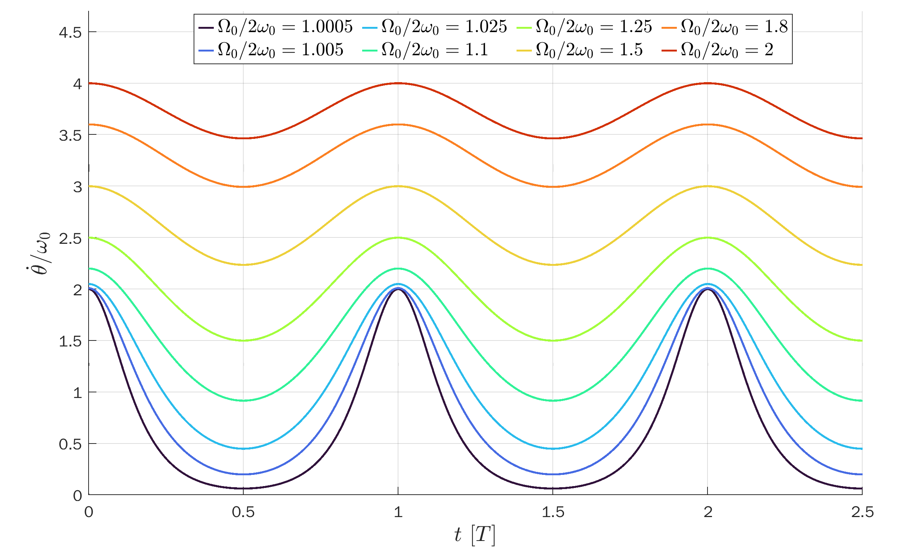

# Exact Solution of a Pendulum in `MATLAB`

The `MATLAB` script [`pendulum.m`](pendulum.m)
produces plots and data files for the exact solutions of a simple pendulum.
It makes use of the [Jacobi elliptic functions](https://en.wikipedia.org/wiki/Jacobi_elliptic_functions),
following the derivation in [this paper](https://www.scielo.br/j/rbef/a/ns9Lc7tfqhZh678dBPXxRsQ/?lang=en).

The solutions are divided into two main cases:
* Closed trajectories.
* Open trajectories.

<p align="center" vertical-align: middle>
  
</p>

## Open trajectories
The pendulum swings back and forth along an arc.
We assume initial conditions &theta;(0) = &theta;<sub>0</sub> < &pi; and &theta;'(0) = 0.
```
w0 = 1; % angular frequency for s.h.o.
k = sin(x0/2); % elliptic modulus
m = k^2;
T = 4*ellipke(m)/w0; % period
[sn,cn,dn] = ellipj(w0*(T/4-t),m); % Jacobi elliptic functions
x = 2*asin(k*sn); % theta (exact pendulum solution)
v = -2*k*w0.*cn.*dn./sqrt(1-(k*sn).^2); % dtheta/dt
```

<p align="center" vertical-align: middle>
  
  
  
  
  
</p>

## Open trajectories
The pendulum goes around in circles without changing angular direction.
We assume initial conditions &theta;(0) = 0; and &theta;'(0) = &Omega;<sub>0</sub> > 2&omega;<sub>0</sub>,
where &omega;<sub>0</sub> is the angular frequency for a simple harmonic oscillator via the small-angle approximation.
For a simple pendulum with a mass suspended from a wire with length L, &omega;<sub>0</sub> = sqrt(g/L).

With these initial conditions, the solution &theta;(t) increases monotonically.
To get this result, one needs to naturally extend the `arcsin`
function by shifting it every half-period ([plot](fig/asin_ext.png)).
This is done by the help function [`asin_ext.m`](asin_ext.m).
```
w0 = 1; % angular frequency for s.h.o.
k = W0/(2*w0); % elliptic modulus
m = k^2;
T = 4*ellipke(1/m)/W0; % period
[sn,~,dn] = ellipj(W0*t/2,1/m); % Jacobi elliptic functions
x = 2*asin_ext(sn,t,2*T); % theta (exact pendulum solution)
v = W0*dn; % dtheta/dt
```

<p align="center" vertical-align: middle>
  
  
  
  
  
</p>

## TikZ figures
The data in the text files are used for the TikZ plot presented [here](https://tikz.net/dynamics_pendulum/).