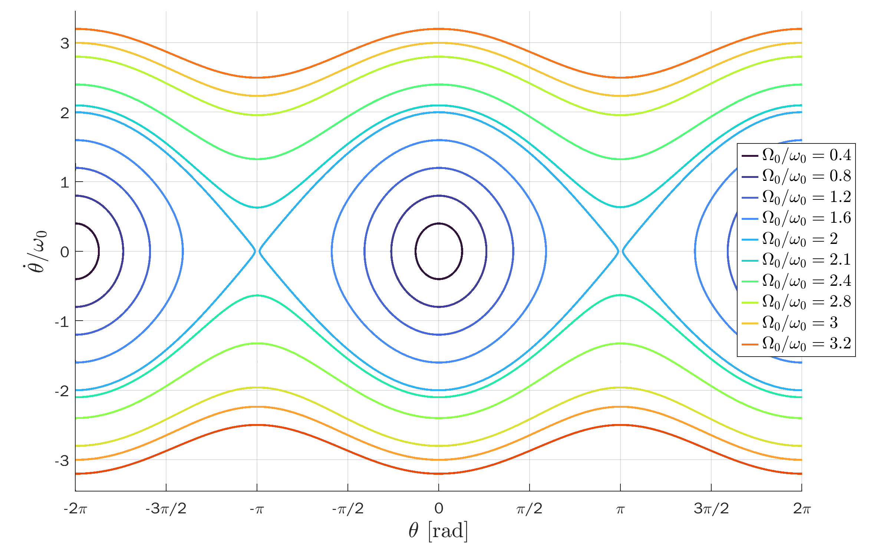
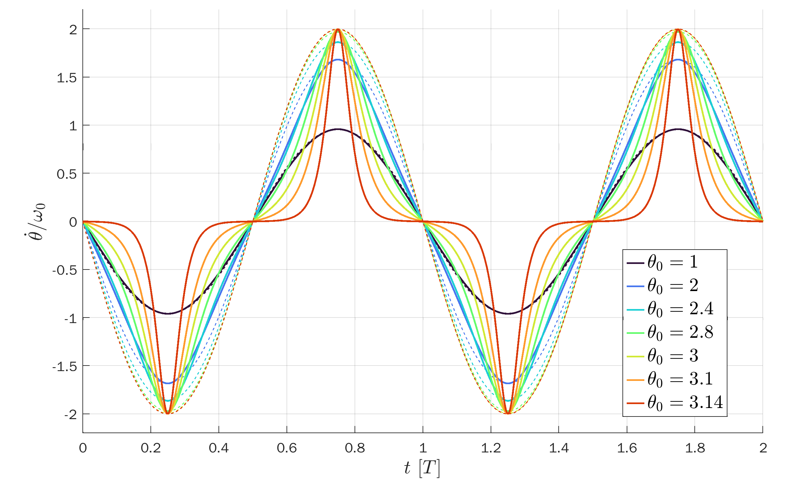
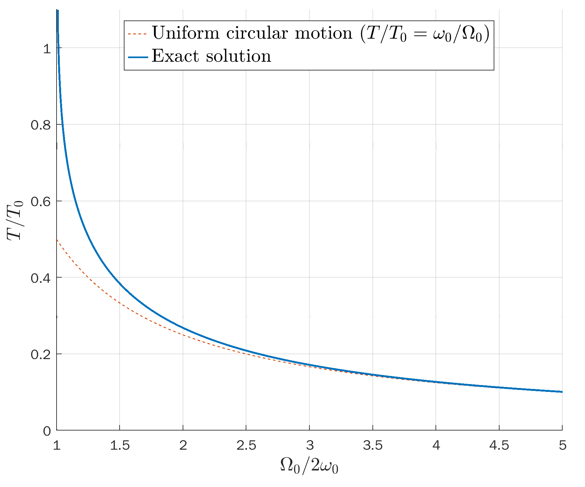

# Exact Solution of a Pendulum in `MATLAB`

The `MATLAB` script [`pendulum.m`](pendulum.m)
produces plots and data files for the exact solutions of a simple pendulum.
It makes use of the [Jacobi elliptic functions](https://en.wikipedia.org/wiki/Jacobi_elliptic_functions),
following the derivation in [this paper](https://www.scielo.br/j/rbef/a/ns9Lc7tfqhZh678dBPXxRsQ/?lang=en)
([PDF](https://www.scielo.br/j/rbef/a/ns9Lc7tfqhZh678dBPXxRsQ/?format=pdf&lang=en)).

The solutions are divided into two main cases:
* Closed trajectories (bounded solution).
* Open trajectories (unbounded solution).

<p align="center">
  
</p>

## Closed trajectories
The pendulum swings back and forth along an arc.
We assume initial conditions
* &theta;(0) = &theta;<sub>0</sub>, with 0 < &theta;<sub>0</sub> < &pi;,
* &theta;'(0) = 0.

The bounded solution is given by
```
w0 = 1; % angular frequency for s.h.o.
k = sin(x0/2); % elliptic modulus
m = k^2;
T = 4*ellipke(m)/w0; % period
[sn,cn,dn] = ellipj(w0*(T/4-t),m); % Jacobi elliptic functions
x = 2*asin(k*sn); % theta (exact pendulum solution)
v = -2*k*w0.*cn.*dn./sqrt(1-(k*sn).^2); % dtheta/dt
```
Here, [`ellipke(m)`](https://ch.mathworks.com/help/matlab/ref/ellipke.html)
is the complete elliptic integral of the first kind in `m`, often denoted by K(m),
and [`ellipj(u,m)`](https://ch.mathworks.com/help/matlab/ref/ellipj.html)
are the  Jacobi elliptic functions `sn`, `cn`, and `dn`.
Note that `MATLAB` also provides the
[Jacobi amplitude function](https://dlmf.nist.gov/22.19)
([`jacobiAM`](https://ch.mathworks.com/help/symbolic/jacobiam.html)),
which give the same solutions.

<p align="center" style="vertical-align:middle">
  
  
  
  
  
  
</p>

## Open trajectories
The pendulum goes around in circles without changing angular direction.
We assume initial conditions
* &theta;(0) = 0;,
* &theta;'(0) = &Omega;<sub>0</sub> > 2&omega;<sub>0</sub>,

where &omega;<sub>0</sub> is the angular frequency for a simple harmonic oscillator via the small-angle approximation.
For a simple pendulum with a mass suspended from a wire with length L, &omega;<sub>0</sub> = sqrt(g/L).

With these initial conditions, the unbounded solution &theta;(t) increases monotonically.
To get this result, one needs to naturally extend the `arcsin`
function by shifting it every half-period ([plot](fig/asin_ext.png)).
This is done by the help function [`asin_ext.m`](asin_ext.m).
```
w0 = 1; % angular frequency for s.h.o.
k = W0/(2*w0); % elliptic modulus
m = k^2;
T = 4*ellipke(1/m)/W0; % period
[sn,~,dn] = ellipj(W0*t/2,1/m); % Jacobi elliptic functions
x = 2*asin_ext(sn,t,2*T); % theta (exact pendulum solution)
v = W0*dn; % dtheta/dt
```
Here, we used the fact that for m > 1, the
[following transformations](https://en.wikipedia.org/wiki/Jacobi_elliptic_functions#The_Jacobi_real_transformations) hold:
* K(m) = K(1/m)/k,
* sn(u,m) = sn(k*u,1/m)/k

Note that if one uses the [`jacobiAM`](https://ch.mathworks.com/help/symbolic/jacobiam.html),
one does not need the extension of `arcsin`, nor the transformations above.

<p align="center" style="vertical-align:middle">
  
  
  
  
  
  
</p>

## `TikZ` figures
The data in the text files are used for the `TikZ` plot presented here:
* [phase portraits](https://tikz.net/dynamics_phaseportrait/),
* [pendulum solutions](https://tikz.net/dynamics_pendulum/).
The data is loaded into `TikZ` as a table in the `axis` environment:
```
\begin{tikzpicture}
  \begin{axis}[
      axis lines=none,anchor=origin,
      x=1cm,y=1cm,ymin=0,
    ]
    \addplot[blue]
      table[x index=0,y index=1] {dynamics_pendulum/data/pendulum_period.txt};
  \end{axis}
\end{tikzpicture}
```

<p align="center" style="vertical-align:middle">
  
  
  
</p>
