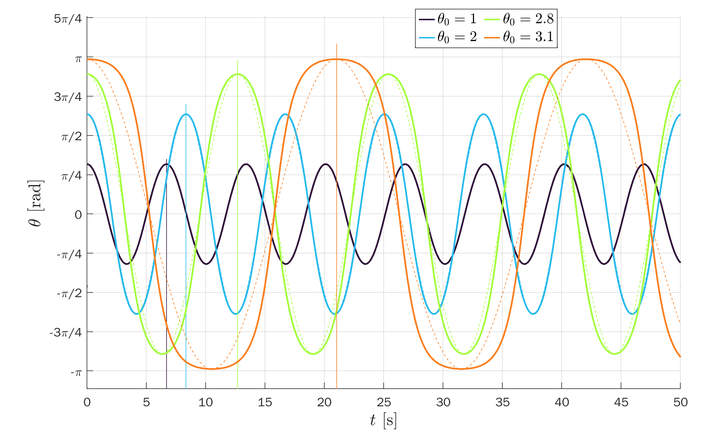
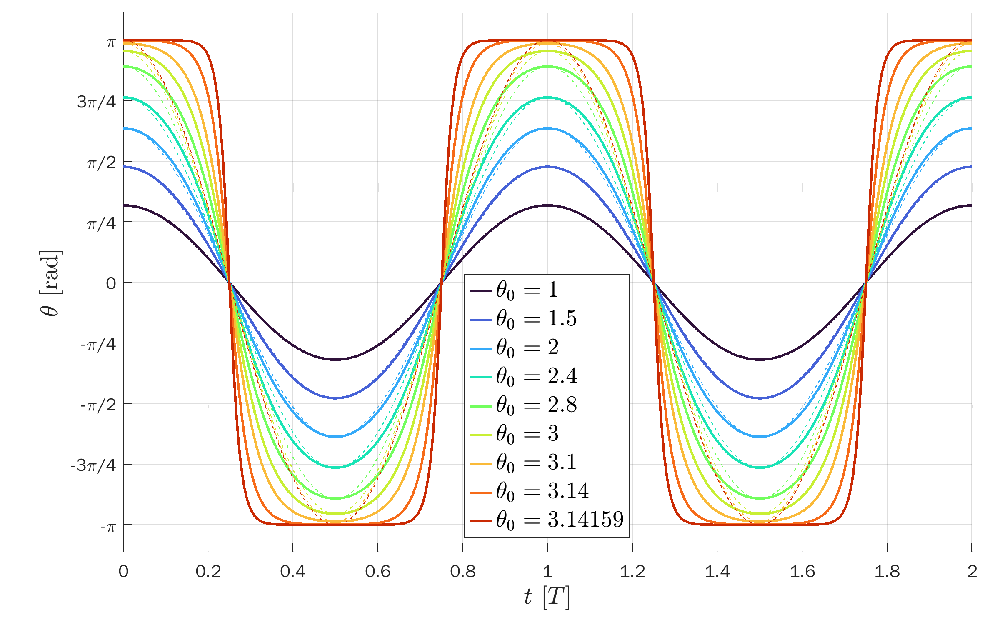
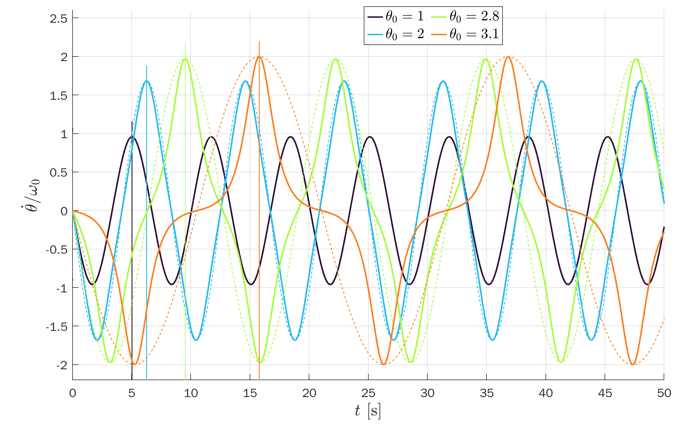
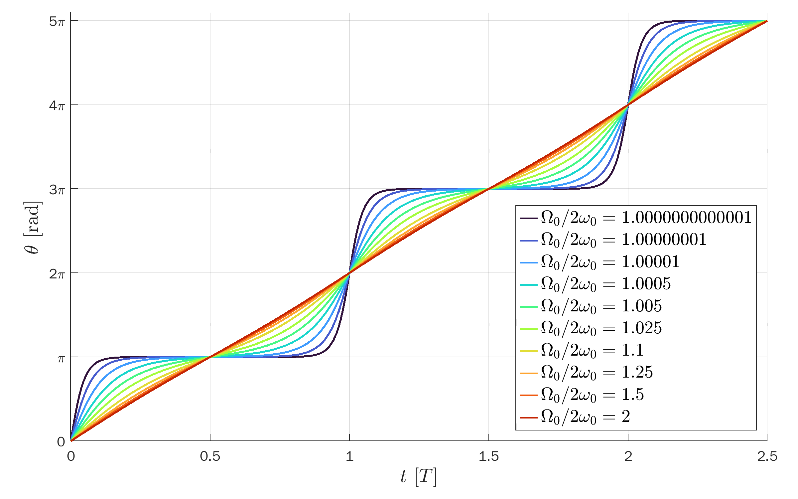
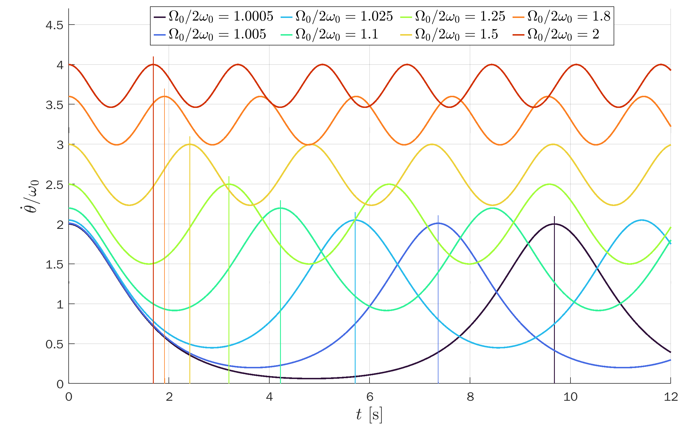

# Exact Solution of a Pendulum in `MATLAB`

The `MATLAB` script [`pendulum.m`](pendulum.m)
produces plots and data files for the exact solutions of a simple pendulum.
It makes use of the Jacobi elliptic functions, following the derivation in
[this paper](https://www.scielo.br/j/rbef/a/ns9Lc7tfqhZh678dBPXxRsQ/?lang=en).

The solutions are divided into two main cases:
* Closed trajectories.
* Open trajectories.

## Open trajectories
The pendulum swings back and forth along an arc.
We assume initial conditions &theta;(0) = &theta;0 < &pi; & &theta;'(0) = 0 < &pi;.

## Open trajectories
The pendulum goes around in circles without changing angular direction.
We assume initial conditions &theta;(0) = 0; & &theta;'(0) = &Omega;0 > 2&omega;0,
where &omega;0 is the angular frequency for a simple harmonic oscillator via the small-angle approximation.
For a simple pendulum with a mass suspended from a wire with length L, &omega;0 = sqrt(g/L).

With these initial conditions, the solution &theta;(t) increases monotonically.
To get this result, one needs to naturally extend the `arcsin` function by shifting it every half-period.
This is done by the help function [`asin_ext.m`](asin_ext.m).

## TikZ figures
The data in the text files are used for the TikZ plot presented [here](https://tikz.net/dynamics_pendulum/).